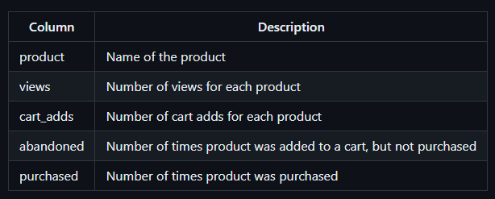

# Case Study #6 - Clique Bait

# **A. Digital Analysis**

**1 - How many users are there?**

```sql
SELECT
 COUNT(DISTINCT user_id) AS user_count
FROM users
```

**2 - How many cookies does each user have on average?**

```sql
SELECT
 ROUND(AVG(cookie_count)) AS avg_cookie
FROM
    (SELECT
        user_id,
        COUNT(cookie_id) AS cookie_count
    FROM users
    GROUP BY user_id) AS sub
```

**3 - What is the unique number of visits by all users per month?**

```sql
SELECT
 MONTH(event_time) AS calendar_month,
    COUNT(DISTINCT visit_id) AS visit_count
FROM events
GROUP BY calendar_month
```

**4 - What is the number of events for each event type?**

```sql
SELECT
 event_type,
    COUNT(*) AS event_count
FROM events
GROUP BY event_type
```

**5 - What is the percentage of visits which have a purchase event?**

```sql
SELECT
 COUNT(DISTINCT visit_id) / (SELECT COUNT(DISTINCT visit_id) FROM events) * 100 AS percentage
FROM events AS e
JOIN event_identifier AS ei ON e.event_type = ei.event_type
WHERE event_name = 'Purchase'
```

**6 - What is the percentage of visits which view the checkout page but do not have a purchase event?**

```sql
SELECT 
    ROUND((1 - SUM(purchase_count)/SUM(view_checkout_count) ) * 100,2) AS percentage
FROM
    (SELECT
        visit_id,
        SUM(IF(event_name = 'Page View' AND page_name = 'Checkout',1,0)) AS view_checkout_count,
        SUM(IF(event_name = 'Purchase',1,0)) AS purchase_count
    FROM events AS e
    JOIN event_identifier AS ei ON ei.event_type = e.event_type
    JOIN page_hierarchy AS ph ON ph.page_id = e.page_id
    GROUP BY visit_id
    ) AS x
```

**7 - What are the top 3 pages by number of views?**

```sql
SELECT
 page_name,
 COUNT(*) AS view_count
FROM events AS e
JOIN event_identifier AS ei ON ei.event_type = e.event_type
JOIN page_hierarchy AS ph ON ph.page_id = e.page_id
WHERE event_name = 'Page View'
GROUP BY page_name
ORDER BY view_count DESC
LIMIT 3
```

**8 - What is the number of views and cart adds for each product category?**

```sql
SELECT
 product_category,
 SUM(IF(event_name = 'Page View',1,0)) AS view_count,
    SUM(IF(event_name = 'Add to Cart',1,0)) AS cart_add
FROM events AS e
JOIN event_identifier AS ei ON ei.event_type = e.event_type
JOIN page_hierarchy AS ph ON ph.page_id = e.page_id
WHERE product_category IS NOT NULL
GROUP BY product_category
ORDER BY view_count DESC
```

**9 - What are the top 3 products by purchases?**

```sql
WITH check_purchase AS
(SELECT
 DISTINCT visit_id
FROM events
WHERE event_type=3)
SELECT
 page_name,
    SUM(IF(event_name = 'Add to Cart',1,0)) AS purchase_count
FROM events AS e
LEFT JOIN check_purchase AS cp ON cp.visit_id = e.visit_id
JOIN event_identifier AS ei ON ei.event_type = e.event_type
JOIN page_hierarchy AS ph ON ph.page_id = e.page_id
WHERE product_id IS NOT NULL
GROUP BY page_name
ORDER BY purchase_count DESC
LIMIT 3
```

# **B. Product Funnel Analysis**

Using a single SQL query - create a new output table which has the following details:

1. How many times was each product viewed?
2. How many times was each product added to cart?
3. How many times was each product added to a cart but not purchased (abandoned)?
4. How many times was each product purchased?



```sql
CREATE VIEW product_analysis AS
WITH check_purchase AS
(SELECT
 visit_id,
 1 AS is_purchase
FROM events
WHERE event_type=3)
SELECT
 product_id,
    product_category,
    page_name,
    SUM(IF(event_name = 'Page View',1,0)) AS views,
    SUM(IF(event_name = 'Add to Cart',1,0)) AS cart_adds,
    SUM(IF(event_name = 'Add to Cart' and is_purchase IS NULL,1,0)) AS abandoned,
    SUM(IF(event_name = 'Add to Cart' and is_purchase = 1,1,0)) AS purchased
FROM events AS e
LEFT JOIN check_purchase AS cp ON cp.visit_id = e.visit_id
JOIN event_identifier AS ei ON ei.event_type = e.event_type
JOIN page_hierarchy AS ph ON ph.page_id = e.page_id
WHERE product_id IS NOT NULL
GROUP BY product_id,page_name,product_category
```

Additionally, create another table which further aggregates the data for the above points but this time for each product category instead of individual products.

```sql
WITH check_purchase AS
(SELECT
 visit_id,
 1 AS is_purchase
FROM events
WHERE event_type=3)
SELECT
    product_category,
    SUM(IF(event_name = 'Page View',1,0)) AS views,
    SUM(IF(event_name = 'Add to Cart',1,0)) AS cart_adds,
    SUM(IF(event_name = 'Add to Cart' AND is_purchase IS NULL,1,0)) AS abandoned,
    SUM(IF(event_name = 'Add to Cart' AND is_purchase = 1,1,0)) AS purchased
FROM events AS e
LEFT JOIN check_purchase AS cp ON cp.visit_id = e.visit_id
JOIN event_identifier AS ei ON ei.event_type = e.event_type
JOIN page_hierarchy AS ph ON ph.page_id = e.page_id
WHERE product_id IS NOT NULL
GROUP BY product_category
```

**1 - Which product had the most views, cart adds and purchases?**

```sql
SELECT
 *
FROM product_analysis
ORDER BY 
    views DESC,
    cart_adds DESC,
    purchased DESC

```

**2 - Which product was most likely to be abandoned?**

```sql
SELECT
 *
FROM product_analysis
ORDER BY abandoned DESC
LIMIT 1

```

**3 - Which product had the highest view to purchase percentage?**

```sql
SELECT
 product_id,
    product_category,
    page_name,
 ROUND(purchased/views * 100,2) AS percentage
FROM product_analysis
ORDER BY percentage DESC
LIMIT 1
```

**4 - What is the average conversion rate from view to cart add?**

```sql
SELECT
 ROUND(AVG(cart_adds/views * 100),2)AS percentage
FROM product_analysis
ORDER BY percentage
```

**5 - What is the average conversion rate from cart add to purchase?**

```sql
SELECT
 ROUND(AVG(purchased/cart_adds * 100),2)AS percentage
FROM product_analysis
ORDER BY percentage
```

# **C. Campaigns Analysis**

Generate a table that has 1 single row for every unique visit_id record and has the following columns:

- `user_id`
- `visit_id`
- `visit_start_time`: the earliest event_time for each visit
- `page_views`: count of page views for each visit
- `cart_adds`: count of product cart add events for each visit
- `purchase`: 1/0 flag if a purchase event exists for each visit
- `campaign_name`: map the visit to a campaign if the visit_start_time falls between the start_date and end_date
- `impression`: count of ad impressions for each visit
- `click`: count of ad clicks for each visit
- (Optional column) `cart_products`: a comma separated text value with products added to the cart sorted by the order they were added to the cart (hint: use the sequence_number)

```sql
WITH subtable AS
(SELECT
 *,
    FIRST_VALUE(event_time) OVER (PARTITION BY visit_id) AS visit_start_time,
    LAST_VALUE(event_type) OVER (PARTITION BY visit_id) AS last_event
FROM events)
SELECT
    visit_id,
    user_id,
    visit_start_time,
    SUM(IF(event_type = 1,1,0)) AS page_views,
    SUM(IF(event_type = 2,1,0)) AS cart_adds,
    IF(last_event = 3,1,0) AS purchase,
    campaign_name,
    SUM(IF(event_type = 4,1,0)) AS impression,
    SUM(IF(event_type = 5,1,0)) AS click,
 GROUP_CONCAT(IF(event_type = 2 AND product_id IS NOT NULL,page_name,NULL)) AS cart_products
FROM subtable AS s
JOIN users AS u ON u.cookie_id = s.cookie_id
JOIN page_hierarchy AS ph ON ph.page_id = s.page_id
LEFT JOIN campaign_identifier AS ci ON s.event_time BETWEEN ci.start_date AND ci.end_date
GROUP BY
 visit_id,
    user_id,
    visit_start_time,
    purchase,
    campaign_name
```

---

[**Case Study #7 - Balanced Tree**](../Case%20Study%20%237%20-%20Balanced%20Tree)
