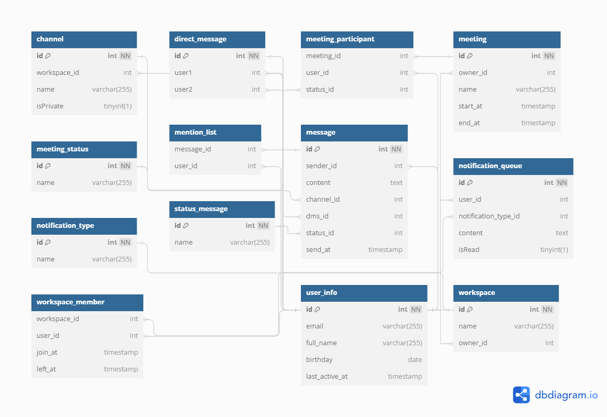

# Dashboard





## Query

```sql
-- Query
-- 1. New member
SELECT
 w.name,
 COUNT(user_id) as new_member
FROM workspace_member as wm
JOIN workspace AS w on w.id = wm.workspace_id
WHERE DATE(join_at) = CURRENT_DATE -- current
GROUP BY w.name;

SELECT
 w.name,
 COUNT(user_id) as new_member
FROM workspace_member as wm
JOIN workspace AS w on w.id = wm.workspace_id
WHERE DATE(join_at) = (CURRENT_DATE - INTERVAL 1 day) -- yesterday
GROUP BY w.name


-- New message
-- 2. Current
WITH id_dms AS
(
  SELECT 
    id
  FROM direct_message
  WHERE user1 = 1 OR user2 = 1
)
SELECT
  COUNT(*) AS new_message
FROM 
  message
WHERE 
  dms_id IN (SELECT id FROM id_dms) AND
  sender_id != 1 AND
  status_id = 2
  
-- 3. Yesterday
WITH id_dms AS
(
  SELECT 
    id
  FROM direct_message
  WHERE user1 = 1 OR user2 = 1
)
SELECT
 COUNT(*) AS new_message
FROM 
 message
WHERE 
  dms_id IN (SELECT id FROM id_dms) AND
  sender_id != 1 AND
  status_id = 2 AND
  DATE(send_at) = CURRENT_DATE() - INTERVAL 1 DAY
   
-- 4. Up coming event
WITH get_meeting_id AS
(
  SELECT *
  FROM meeting_participant
  WHERE user_id =1 and status_id = 1
)
SELECT *
FROM meeting
WHERE 
  id IN (SELECT meeting_id FROM get_meeting_id) AND
  start_at > CURRENT_TIMESTAMP() AND 
  DATE(start_at) = CURRENT_DATE();
    
-- 5. Member left
SELECT 
  COUNT(*) AS member_left_count
FROM
  workspace_member
WHERE DATE(left_at) = CURRENT_DATE()

-- 6. Member active
SELECT 
  COUNT(*)
FROM
  workspace_member wm
JOIN 
  `user` u ON wm.user_id = u.id AND is_active = 1
WHERE workspace_id = 1 


-- 7. Notification
SELECT 
  *
FROM
  notification_queue
WHERE 
  user_id = 1 AND
  is_read = 0
```
