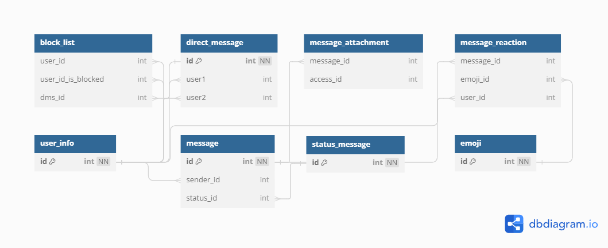

# Direct Message





**[DBML FILE](dbml.md)**

## Create table and insert data

```sql
CREATE TABLE `block_list` (
  `user_id` int DEFAULT null,
  `user_id_is_blocked` int,
  `dms_id` int
);
ALTER TABLE `block_list` ADD FOREIGN KEY (`user_id`) REFERENCES `user_info` (`id`);

ALTER TABLE `block_list` ADD FOREIGN KEY (`user_id_is_blocked`) REFERENCES `user_info` (`id`);

ALTER TABLE `block_list` ADD FOREIGN KEY (`dms_id`) REFERENCES `direct_message` (`id`);
```

## Query

```sql
-- Get all dms
SELECT *
FROM direct_message
WHERE user1 = 1 OR user2 = 1

-- Get specific dms
SELECT *
FROM message
WHERE dms_id = 1

-- Get files in dms
SELECT *
FROM message_attachment ma
JOIN message m ON m.id = ma.message_id AND m.dms_id = 1

-- Get user is blocked
SELECT *
FROM block_list
WHERE user_id = 1
```
