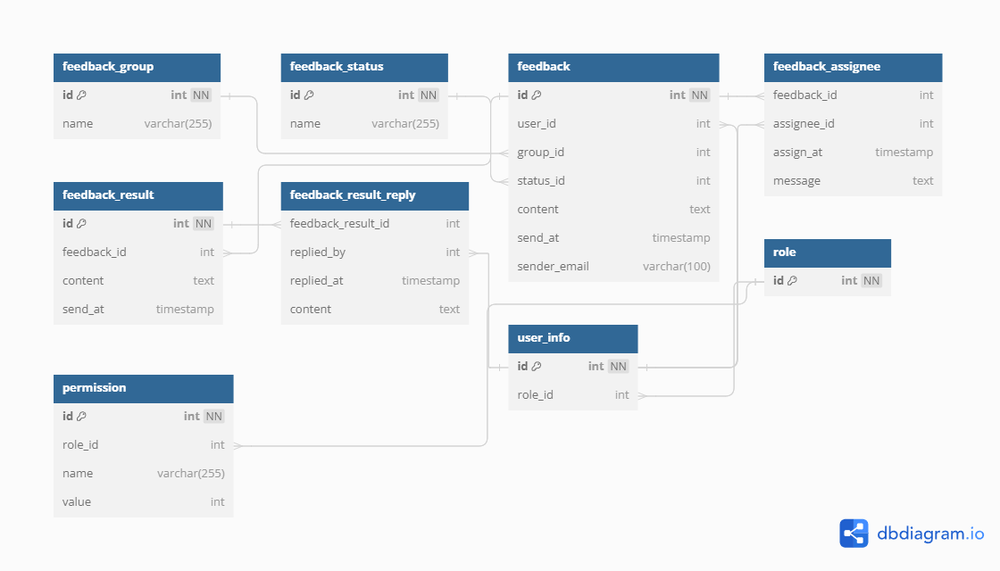

# Meeting





**[DBML FILE](dbml.md)**

## Create table and insert data

```sql
```

## Query

```sql
-- Get meeting info
SELECT *
FROM meeting
WHERE id = 1

-- Get meeting participant
SELECT *
FROM meeting_participant
WHERE meeting_id = 1 AND status_id = 1

-- Get message in meeting
SELECT 
    sender_id,
    content,
    send_at
FROM message
WHERE meeting_id = 1

```
