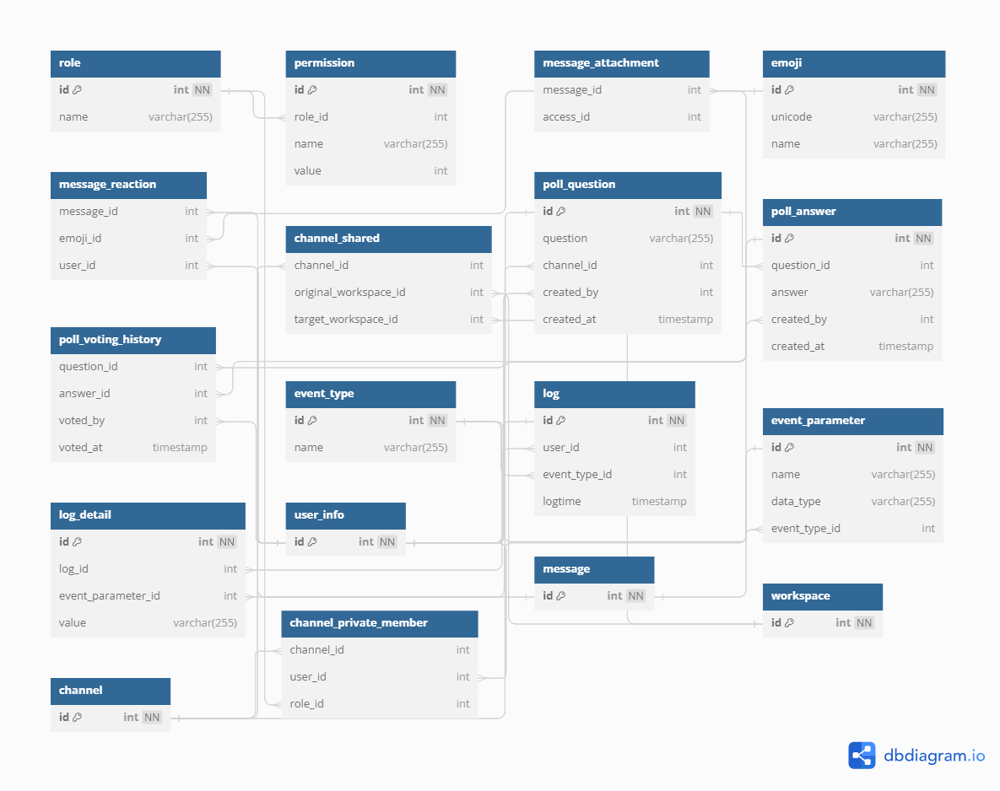

# Home





**[DBML FILE](dbml.md)**

## Create table and insert data

```sql
CREATE TABLE `role` (
  `id` int PRIMARY KEY NOT NULL AUTO_INCREMENT,
  `name` varchar(255) DEFAULT null
);

CREATE TABLE `permission` (
  `id` int PRIMARY KEY NOT NULL AUTO_INCREMENT,
  `role_id` int DEFAULT null,
  `name` varchar(255) DEFAULT null,
  `value` int DEFAULT null
);

CREATE TABLE `message_attachment` (
  `message_id` int DEFAULT null,
  `access_id` int
);

CREATE TABLE `emoji` (
  `id` int PRIMARY KEY NOT NULL AUTO_INCREMENT,
  `unicode` varchar(255) DEFAULT null,
  `name` varchar(255) DEFAULT null
);

CREATE TABLE `message_reaction` (
  `message_id` int DEFAULT null,
  `emoji_id` int DEFAULT null,
  `user_id` int DEFAULT null
);

CREATE TABLE `channel_shared` (
  `channel_id` int DEFAULT null,
  `original_workspace_id` int DEFAULT null,
  `target_workspace_id` int DEFAULT null
);

CREATE TABLE `channel_private_member` (
  `channel_id` int DEFAULT null,
  `user_id` int DEFAULT null,
  `role_id` int DEFAULT null
)

CREATE TABLE `poll_question` (
  `id` int PRIMARY KEY NOT NULL AUTO_INCREMENT,
  `question` varchar(255) DEFAULT null,
  `channel_id` int DEFAULT null,
  `created_by` int DEFAULT null,
  `created_at` timestamp
);

CREATE TABLE `poll_answer` (
  `id` int PRIMARY KEY NOT NULL AUTO_INCREMENT,
  `question_id` int DEFAULT null,
  `answer` varchar(255) DEFAULT null,
  `created_by` int DEFAULT null,
  `created_at` timestamp
);

CREATE TABLE `poll_voting_history` (
  `question_id` int DEFAULT null,
  `answer_id` int DEFAULT null,
  `voted_by` int DEFAULT null,
  `voted_at` timestamp
);

CREATE TABLE `event_type` (
  `id` int PRIMARY KEY NOT NULL AUTO_INCREMENT,
  `name` varchar(255) DEFAULT null
);

CREATE TABLE `log` (
  `id` int PRIMARY KEY NOT NULL AUTO_INCREMENT,
  `user_id` int DEFAULT null,
  `event_type_id` int DEFAULT null,
  `logtime` timestamp
);

CREATE TABLE `event_parameter` (
  `id` int PRIMARY KEY NOT NULL AUTO_INCREMENT,
  `name` varchar(255),
  `data_type` varchar(255),
  `event_type_id` int DEFAULT null
);

CREATE TABLE `log_detail` (
  `id` int PRIMARY KEY NOT NULL AUTO_INCREMENT,
  `log_id` int DEFAULT null,
  `event_parameter_id` int DEFAULT null,
  `value` varchar(255)
);


ALTER TABLE `permission` ADD FOREIGN KEY (`role_id`) REFERENCES `role` (`id`);

ALTER TABLE `message_attachment` ADD FOREIGN KEY (`message_id`) REFERENCES `message` (`id`);

ALTER TABLE `message_reaction` ADD FOREIGN KEY (`message_id`) REFERENCES `message` (`id`);

ALTER TABLE `message_reaction` ADD FOREIGN KEY (`emoji_id`) REFERENCES `emoji` (`id`);

ALTER TABLE `message_reaction` ADD FOREIGN KEY (`user_id`) REFERENCES `user_info` (`id`);

ALTER TABLE `channel_shared` ADD FOREIGN KEY (`channel_id`) REFERENCES `channel` (`id`);

ALTER TABLE `channel_shared` ADD FOREIGN KEY (`original_workspace_id`) REFERENCES `workspace` (`id`);

ALTER TABLE `channel_shared` ADD FOREIGN KEY (`target_workspace_id`) REFERENCES `workspace` (`id`);

ALTER TABLE `channel_private_member` ADD FOREIGN KEY (`channel_id`) REFERENCES `channel` (`id`);

ALTER TABLE `channel_private_member` ADD FOREIGN KEY (`user_id`) REFERENCES `user_info` (`id`);

ALTER TABLE `channel_private_member` ADD FOREIGN KEY (`role_id`) REFERENCES `role` (`id`);

ALTER TABLE `poll_question` ADD FOREIGN KEY (`channel_id`) REFERENCES `channel` (`id`);

ALTER TABLE `poll_question` ADD FOREIGN KEY (`created_by`) REFERENCES `user_info` (`id`);

ALTER TABLE `poll_answer` ADD FOREIGN KEY (`question_id`) REFERENCES `poll_question` (`id`);

ALTER TABLE `poll_answer` ADD FOREIGN KEY (`created_by`) REFERENCES `user_info` (`id`);

ALTER TABLE `poll_voting_history` ADD FOREIGN KEY (`question_id`) REFERENCES `poll_question` (`id`);

ALTER TABLE `poll_voting_history` ADD FOREIGN KEY (`answer_id`) REFERENCES `poll_answer` (`id`);

ALTER TABLE `poll_voting_history` ADD FOREIGN KEY (`voted_by`) REFERENCES `user_info` (`id`);

ALTER TABLE `log` ADD FOREIGN KEY (`user_id`) REFERENCES `user_info` (`id`);

ALTER TABLE `log` ADD FOREIGN KEY (`event_type_id`) REFERENCES `event_type` (`id`);

ALTER TABLE `event_parameter` ADD FOREIGN KEY (`event_type_id`) REFERENCES `event_type` (`id`);

ALTER TABLE `log_detail` ADD FOREIGN KEY (`log_id`) REFERENCES `log` (`id`);

ALTER TABLE `log_detail` ADD FOREIGN KEY (`event_parameter_id`) REFERENCES `event_parameter` (`id`);

```

## Query

```sql
-- Get channels in workspace
SELECT 
 *
FROM channel
WHERE workspace_id = 1
 
-- Get member in private channel
SELECT
 *
FROM channel_private_member
WHERE channel_id = 1

-- Get message in channel
SELECT 
 *
FROM message
WHERE channel_id = 1

-- Get thread
SELECT
 *
FROM message
WHERE parent_id = 1

-- Get poll
SELECT
 *
FROM poll_question
WHERE channel_id = 1

SELECT 
 *
FROM poll_answer
WHERE question_id = 1

SELECT
 *
FROM poll_voting_history
WHERE question_id = 1


--  Get attachment
SELECT
 *
FROM message_attachment
WHERE message_id IN (SELECT message_id FROM message WHERE channel_id = 1)

-- Get reaction of message
SELECT
 *
FROM message_reaction mr
JOIN emoji e ON mr.emoji_id = e.id
WHERE message_id = 1 

SELECT
 COUNT(*)
FROM message_reaction mr
JOIN emoji e ON mr.emoji_id = e.id
WHERE message_id = 1 
GROUP BY message_id

-- Get log activity
SELECT
 *
FROM log l
JOIN event_type et ON l.event_type_id = et.id 
JOIN event_parameter ep ON et.id = ep.event_type_id
JOIN log_detail ld ON l.id = ld.log_id AND ld.event_parameter_id = ep.id
WHERE user_id = 1
```
